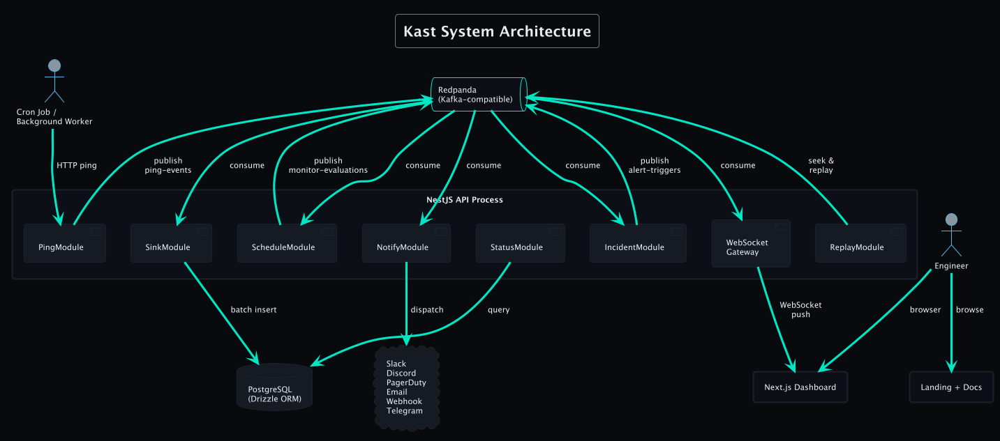

<p align="center">
  
</p>

<h1 align="center">Kast</h1>

<p align="center">
  Open-source, event-driven monitoring platform for cron jobs, scheduled tasks, and data pipelines.<br/>
  Built on Redpanda, PostgreSQL, and a visual DAG workflow engine.
</p>

<p align="center">
  <a href="#quickstart">Quickstart</a> &middot;
  <a href="#features">Features</a> &middot;
  <a href="#dag-workflow-engine">Workflow Engine</a> &middot;
  <a href="#architecture">Architecture</a> &middot;
  <a href="#deployment">Deployment</a> &middot;
  <a href="https://kast.dev/docs">Docs</a>
</p>

---

## What is Kast?

Cron jobs fail silently. A backup script stops running, an ETL pipeline hangs, a queue worker crashes at 3 AM, and nobody notices until a customer reports missing data. Existing monitoring tools are either expensive SaaS products with per-monitor pricing or aging open-source projects built on polling.

Kast takes a different approach. Every ping, state change, incident, and alert is a durable event in a Redpanda distributed log. PostgreSQL stores derived projections for fast queries, but Redpanda is the source of truth. The entire system is auditable, replayable, and extensible.

Your jobs send HTTP pings when they start, succeed, or fail. If a ping arrives late, exceeds its maximum runtime, or reports a failure, Kast opens an incident and alerts you through any combination of six channels.

## Demo


### DAG Workflow Canvas

Visual drag-and-drop pipeline builder with condition branching, parallel fan-out, webhook wait nodes, and durable replay-based execution.


<details>
<summary><strong>More feature demos</strong></summary>

<br/>

**Monitors** | Heartbeat monitoring with cron scheduling, grace periods, and health tracking.


**Jobs** | Scheduled HTTP execution with retries, concurrency control, and run history.


**Workflow Editor** | Node configuration panels, condition branching, and multi-pipeline editing.


**Incidents** | Automatic detection, acknowledgment, and resolution tracking.


**Alerts** | Multi-channel routing with cooldowns and failure thresholds.


**Teams** | Team-scoped monitors, jobs, and API keys.


</details>

## Features

### Monitoring & Alerting

- **Heartbeat monitoring** with 5-field cron or interval scheduling, grace periods, and max runtime enforcement
- **Six alert channels**: Slack, Discord, email, webhooks, PagerDuty, Telegram
- **Per-monitor routing** with cooldowns, failure thresholds, and automatic retry with exponential backoff
- **Incident lifecycle**: auto-open on failure, escalation tracking, auto-resolve on recovery
- **Dead letter queue** for failed alert deliveries with one-click retry

### DAG Workflow Engine

- **Six node types**: HTTP request, sleep, condition (expression-based branching), run_job (child spawning), fan_out (parallel execution), webhook_wait (external signals)
- **Durable execution** that survives process restarts via Redpanda event log
- **Replay-based memoization**: completed steps are never re-executed on resume
- **Visual canvas editor** built on React Flow with drag-and-drop, auto-layout (Dagre), and live execution visualization
- **Versioned workflows**: in-flight runs continue on their original version while new runs use the latest

### Job Scheduling

- **Cron-triggered HTTP execution** with configurable method, headers, body, and timeout
- **Retry policies**: max attempts, exponential backoff, configurable delay ceiling
- **Concurrency control**: queue, skip, or cancel policies
- **Structured logging** with per-run log streams

### Real-Time Dashboard

- **Zero-poll architecture** with WebSocket (Socket.IO) streaming to the browser
- **Live event stream** page showing pings, state changes, and incidents as they happen
- **Event replay** with seek-to-timestamp via Server-Sent Events
- **Public status pages** with per-monitor 30-day uptime bars

### Platform

- **Event sourcing** across 14 Redpanda topics with 19 consumer groups
- **Prometheus metrics** endpoint (`/metrics`) with custom and Node.js runtime metrics
- **Declarative config management** via `kast apply -f kast.yaml`
- **Multi-tenant** team isolation with team-scoped API keys
- **REST API** with full Swagger documentation

## Tech Stack

| Layer | Technology |
|-------|-----------|
| Backend | NestJS 11 / TypeScript (25 modules) |
| Event Streaming | Redpanda (Kafka-compatible) |
| Database | PostgreSQL 17 + Drizzle ORM |
| Dashboard | Next.js 16 + shadcn/ui + Tailwind CSS 4 |
| Workflow Canvas | React Flow + Dagre auto-layout |
| Real-time | Socket.IO (WebSocket) |
| Charts | Recharts |
| CLI | Commander.js |
| Docs | Fumadocs |
| Monorepo | Turborepo + pnpm |
| Infrastructure | Docker, Terraform (AWS) |

## Quickstart

```bash
git clone https://github.com/elliot736/kast.git
cd kast
pnpm install
docker compose up -d redpanda postgres
cd apps/api && pnpm db:migrate
cd ../..
pnpm dev
```

| Service | URL |
|---------|-----|
| Dashboard | http://localhost:3002 |
| API | http://localhost:3001 |
| Docs | http://localhost:3003 |
| Redpanda Console | http://localhost:28080 |

### Create your first monitor

```bash
# 1. Create an API key
curl -X POST http://localhost:3001/api/v1/api-keys \
  -H 'Content-Type: application/json' \
  -d '{"label": "my-app"}'

# 2. Create a monitor (save the pingUuid from the response)
curl -X POST http://localhost:3001/api/v1/monitors \
  -H 'x-api-key: kst_YOUR_KEY' \
  -H 'Content-Type: application/json' \
  -d '{"name": "DB Backup", "slug": "db-backup", "schedule": "0 3 * * *"}'

# 3. Ping from your cron job
curl -fsS --retry 3 http://localhost:3001/ping/PING_UUID/success
```

### Integration

**Bash**
```bash
curl -fsS --retry 3 https://kast.example.com/ping/UUID/start
./my-backup-script.sh
curl -fsS --retry 3 https://kast.example.com/ping/UUID/success
```

**Python**
```python
import requests
requests.post("https://kast.example.com/ping/UUID/start")
try:
    run_job()
    requests.get("https://kast.example.com/ping/UUID/success")
except Exception as e:
    requests.post("https://kast.example.com/ping/UUID/fail", data=str(e))
```

**Node.js**
```javascript
await fetch("https://kast.example.com/ping/UUID/start", { method: "POST" });
try {
  await runJob();
  await fetch("https://kast.example.com/ping/UUID/success");
} catch (err) {
  await fetch("https://kast.example.com/ping/UUID/fail", {
    method: "POST", body: err.message
  });
}
```

## Architecture

```
┌──────────────────────────────────────────────────────────┐
│                    NestJS API (25 modules)                │
│                                                          │
│  PingModule         -> publishes to ping-events          │
│  SinkModule         -> consumes events -> PostgreSQL     │
│  ScheduleModule     -> 60s sweep -> detects late/down    │
│  IncidentModule     -> opens/escalates/resolves          │
│  NotifyModule       -> dispatches to 6 alert channels    │
│  JobSchedulerModule -> cron triggers -> job-triggers     │
│  JobExecutorModule  -> HTTP execution with retries       │
│  WorkflowEngine     -> DAG replay with memoization       │
│  WebSocketGateway   -> live push to dashboard            │
│  ReplayModule       -> seek Redpanda offsets -> SSE      │
│                                                          │
│  ┌────────────────────────────────────────────────────┐  │
│  │  Redpanda (Kafka-compatible)                       │  │
│  │  14 topics, partitioned by monitor/job UUID        │  │
│  └────────────────────────────────────────────────────┘  │
│  ┌────────────────────────────────────────────────────┐  │
│  │  PostgreSQL 17 (Drizzle ORM projections)           │  │
│  └────────────────────────────────────────────────────┘  │
└──────────────────────────────────────────────────────────┘
```

**Monitoring flow**: HTTP ping hits the API. PingModule publishes to `ping-events`. SinkModule projects to PostgreSQL. ScheduleModule evaluates the cron schedule on a 60-second sweep. IncidentModule opens incidents on failure. NotifyModule dispatches alerts. WebSocket pushes updates to the dashboard in real time.

**Job execution flow**: Cron trigger or manual API call publishes to `job-triggers`. JobExecutor delegates to WorkflowEngine, which walks the DAG, executing HTTP calls, evaluating conditions, sleeping, and fanning out to parallel branches. Completed step results are memoized for replay. Results publish to `job-results` and project to PostgreSQL.

### Ping Protocol

| Endpoint | Method | Purpose |
|----------|--------|---------|
| `/ping/:uuid` | GET | Simple success ping |
| `/ping/:uuid/start` | POST | Mark job as started |
| `/ping/:uuid/success` | POST | Mark job as succeeded |
| `/ping/:uuid/fail` | POST | Mark job as failed (body = error) |
| `/ping/:uuid/log` | POST | Append log output |

### DAG Workflow Engine

| Node Type | Purpose |
|-----------|---------|
| `run` | HTTP request with configurable method, headers, body, timeout, and success codes |
| `sleep` | Pause for an ISO 8601 duration (survives restarts) |
| `condition` | Expression-based branching with true/false output paths |
| `run_job` | Spawn a child job in wait or fire-and-forget mode |
| `fan_out` | Parallel execution with configurable concurrency and fail-fast |
| `webhook_wait` | Pause until an external webhook signal arrives (optional timeout) |

## Project Structure

```
kast/
├── apps/
│   ├── api/           # NestJS backend (25 modules, event sourcing, DAG engine)
│   ├── web/           # Next.js dashboard (React Flow canvas, real-time updates)
│   └── landing/       # Documentation site (Fumadocs)
├── packages/
│   └── cli/           # CLI tool (Commander.js)
├── tests/e2e/         # Playwright API tests
├── terraform/         # AWS deployment (ECS Fargate, Aurora, MSK)
├── docker-compose.yml # Local development stack
└── turbo.json         # Monorepo build orchestration
```

## Deployment

### Docker Compose (local/self-hosted)

```bash
docker compose up -d
```

Starts Redpanda, PostgreSQL, the API, and the dashboard. See the [self-hosting docs](https://kast.dev/docs/self-hosting) for production configuration.

### AWS (Terraform)

Production-ready Terraform configuration that deploys the full stack to AWS.


| Component | AWS Service |
|-----------|------------|
| Load Balancer | Application Load Balancer |
| API + Dashboard | ECS Fargate (auto-scaling) |
| Database | Aurora PostgreSQL 17 Serverless v2 |
| Event Streaming | Amazon MSK (Kafka 3.7) |
| Secrets | AWS Secrets Manager |
| Container Images | Amazon ECR |
| Logging | CloudWatch |

```bash
cd terraform
cp terraform.tfvars.example terraform.tfvars
terraform init && terraform plan && terraform apply
```

## CLI

```bash
kast health                          # Check API and dependency status
kast monitors list                   # List all monitors
kast monitors create --name "..." --slug "..." --schedule "..."
kast incidents list --status open    # View open incidents
kast incidents ack INCIDENT_ID       # Acknowledge an incident
kast ping UUID                       # Send a success ping
kast wrap -m UUID -- ./backup.sh     # Wrap a command with start/success/fail pings
kast apply -f kast.yaml              # Apply declarative configuration
```

## API Reference

Full Swagger documentation is available at `/api/docs` when the API is running.

<details>
<summary><strong>Endpoint overview</strong></summary>

<br/>

All management endpoints require an `x-api-key` header.

**Monitors**

| Method | Endpoint | Description |
|--------|----------|-------------|
| POST | `/api/v1/monitors` | Create monitor |
| GET | `/api/v1/monitors` | List monitors (filter by status, tag, team) |
| GET | `/api/v1/monitors/:id` | Get monitor detail |
| PATCH | `/api/v1/monitors/:id` | Update monitor |
| DELETE | `/api/v1/monitors/:id` | Delete monitor |
| POST | `/api/v1/monitors/:id/pause` | Pause monitoring |
| POST | `/api/v1/monitors/:id/resume` | Resume monitoring |
| GET | `/api/v1/monitors/:id/pings` | Ping history |
| GET | `/api/v1/monitors/:id/stats` | Uptime %, avg runtime, failure rate |

**Jobs**

| Method | Endpoint | Description |
|--------|----------|-------------|
| POST | `/api/v1/jobs` | Create job |
| GET | `/api/v1/jobs` | List jobs |
| PATCH | `/api/v1/jobs/:id` | Update job |
| DELETE | `/api/v1/jobs/:id` | Delete job (cascades runs) |
| POST | `/api/v1/jobs/:id/trigger` | Trigger a manual run |
| POST | `/api/v1/jobs/:id/pause` | Pause scheduled execution |
| POST | `/api/v1/jobs/:id/resume` | Resume execution |
| GET | `/api/v1/jobs/:id/runs` | List job runs |
| GET | `/api/v1/jobs/:id/runs/:runId` | Get run detail |
| PUT | `/api/v1/jobs/:id/workflow` | Create or update workflow DAG |
| GET | `/api/v1/jobs/:id/workflow` | Get workflow definition |
| GET | `/api/v1/jobs/:id/runs/:runId/workflow` | Workflow run with step results |

**Incidents**

| Method | Endpoint | Description |
|--------|----------|-------------|
| GET | `/api/v1/incidents` | List incidents (filter by status) |
| GET | `/api/v1/incidents/:id` | Incident detail |
| POST | `/api/v1/incidents/:id/acknowledge` | Acknowledge incident |

**Alerts**

| Method | Endpoint | Description |
|--------|----------|-------------|
| POST | `/api/v1/alert-configs` | Create alert config |
| GET | `/api/v1/alert-configs` | List alert configs |
| DELETE | `/api/v1/alert-configs/:id` | Delete alert config |
| GET | `/api/v1/dead-letters` | Failed alert deliveries |
| POST | `/api/v1/dead-letters/:id/retry` | Retry failed delivery |

**Teams & API Keys**

| Method | Endpoint | Description |
|--------|----------|-------------|
| POST | `/api/v1/teams` | Create team |
| GET | `/api/v1/teams` | List teams |
| DELETE | `/api/v1/teams/:id` | Delete team |
| POST | `/api/v1/api-keys` | Create API key |
| GET | `/api/v1/api-keys` | List API keys |
| DELETE | `/api/v1/api-keys/:id` | Revoke API key |

**Replay**

| Method | Endpoint | Description |
|--------|----------|-------------|
| POST | `/api/v1/replay` | Start replay session |
| GET | `/api/v1/replay/:id/events` | Stream replayed events (SSE) |

</details>

## Development

```bash
pnpm install               # Install dependencies
docker compose up -d       # Start Redpanda + PostgreSQL
pnpm db:migrate            # Run database migrations
pnpm dev                   # Start API + Dashboard + Docs

cd apps/api && pnpm test   # Unit tests
pnpm test:e2e              # E2E tests (Playwright)
```

## License

MIT
