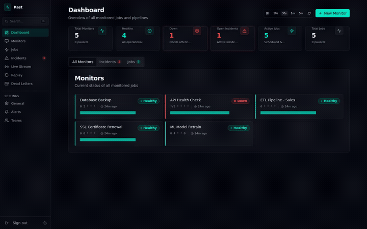
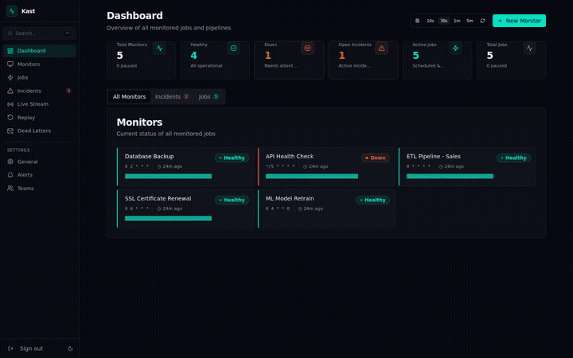
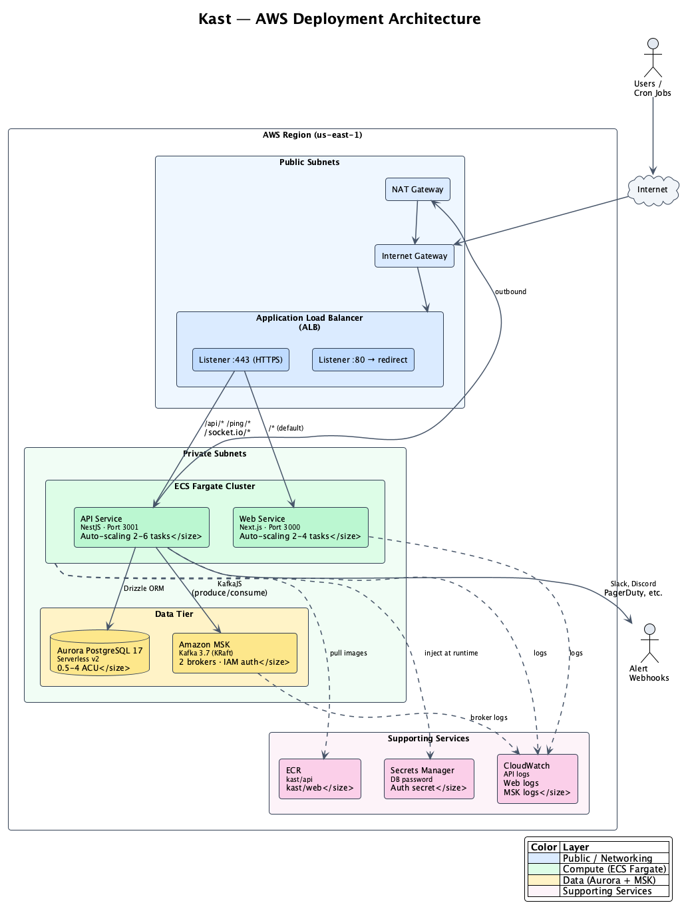

# Kast

**Open-source, event-driven job & pipeline monitor.**

Kast watches your cron jobs, scheduled tasks, and data pipelines. When a job doesn't ping on time, runs too long, or reports a failure, Kast alerts you through Slack, Discord, email, webhooks, PagerDuty, or Telegram.

Built on Redpanda (Kafka-compatible), every event is durable and replayable. No polling — real-time streaming to your dashboard.

## Demo

### Dashboard Overview


### DAG Workflow Canvas

Build complex multi-step pipelines with a visual drag-and-drop canvas. Supports HTTP requests, sleep nodes, conditional branching, parallel fan-out, child job spawning, and webhook wait nodes — all with durable replay-based execution.


<details>
<summary>See all feature demos</summary>

### Monitors — Heartbeat Monitoring

Track cron jobs and scheduled tasks with 5-field cron or interval-based scheduling, grace periods, and health status tracking.


### Jobs — Scheduled HTTP Execution

Configure jobs with retry policies, concurrency control, and automatic scheduling.


### Workflow Canvas — Deep Dive

Explore the workflow editor in detail: node configuration panels, condition branching (true/false paths), webhook wait nodes, auto-layout, and the full ETL pipeline and canary deployment examples.


### Incidents

Automatic incident detection when pings are late or jobs fail, with acknowledgment and resolution tracking.



### Alert Configuration

Route alerts to Slack, Discord, PagerDuty, email, webhooks, or Telegram with per-monitor routing, cooldowns, and failure thresholds.



### Teams & Settings

Organize monitors and jobs by team with isolated access and team-scoped API keys.


</details>

## Quickstart

```bash
git clone https://github.com/your-org/kast.git
cd kast
pnpm install
docker compose up -d redpanda postgres
cd apps/api && pnpm db:migrate
cd ../..
pnpm dev
```

- **API**: http://localhost:3001
- **Dashboard**: http://localhost:3002 (dev) / http://localhost:3000 (prod)
- **Docs**: http://localhost:3003
- **Swagger docs**: http://localhost:3001/api/docs
- **Redpanda Console**: http://localhost:28080

### First monitor in 60 seconds

```bash
# 1. Create an API key
curl -X POST http://localhost:3001/api/v1/api-keys \
  -H 'Content-Type: application/json' \
  -d '{"label": "my-app"}'
# Save the returned key

# 2. Create a monitor
curl -X POST http://localhost:3001/api/v1/monitors \
  -H 'x-api-key: kst_YOUR_KEY' \
  -H 'Content-Type: application/json' \
  -d '{"name": "DB Backup", "slug": "db-backup", "schedule": "0 3 * * *"}'
# Note the pingUuid in the response

# 3. Add to your cron job
curl -fsS --retry 3 http://localhost:3001/ping/PING_UUID/success
```

## Architecture

```
┌──────────────────────────────────────────────────────┐
│                  NestJS Process                       │
│                                                       │
│  PingModule → publishes to ping-events                │
│  SinkModule → consumes → writes to Postgres           │
│  ScheduleModule → evaluates cron → detects late       │
│  IncidentModule → opens/resolves incidents             │
│  NotifyModule → dispatches Slack/Discord/etc           │
│  JobExecutor → delegates to WorkflowEngine             │
│  WorkflowEngine → DAG replay/memoize execution         │
│  WebSocketGateway → pushes to dashboard                │
│  ReplayModule → seeks Redpanda offsets → SSE           │
│                                                       │
│  ┌─────────────────────────────────────────────────┐  │
│  │         Redpanda (Kafka-compatible)              │  │
│  │  14 topics · partitioned by monitor/job UUID     │  │
│  └─────────────────────────────────────────────────┘  │
│  ┌─────────────────────────────────────────────────┐  │
│  │     PostgreSQL (Drizzle ORM projections)         │  │
│  └─────────────────────────────────────────────────┘  │
└──────────────────────────────────────────────────────┘
```

**Monitoring flow**: Job sends HTTP ping → PingModule publishes to `ping-events` → SinkModule writes to Postgres → ScheduleModule evaluates schedule → IncidentModule opens incidents → NotifyModule dispatches alerts → WebSocket pushes to dashboard.

**Job execution flow**: Cron fires or manual trigger → `job-triggers` → JobExecutor delegates to WorkflowEngine → DAG nodes execute (HTTP calls, sleep, conditions, fan-out) → `job-results` → JobBridge writes to DB.

## Ping Protocol

| Endpoint | Method | Description |
|----------|--------|-------------|
| `/ping/:uuid` | GET | Simple success ping |
| `/ping/:uuid/start` | POST | Job started |
| `/ping/:uuid/success` | POST | Job succeeded |
| `/ping/:uuid/fail` | POST | Job failed (body = error output) |
| `/ping/:uuid/log` | POST | Append log output |

### Integration examples

**Bash**
```bash
curl -fsS --retry 3 https://kast.example.com/ping/UUID/start
./my-backup-script.sh
curl -fsS --retry 3 https://kast.example.com/ping/UUID/success
```

**Python**
```python
import requests
requests.post("https://kast.example.com/ping/UUID/start")
try:
    run_job()
    requests.get("https://kast.example.com/ping/UUID/success")
except Exception as e:
    requests.post("https://kast.example.com/ping/UUID/fail", data=str(e))
```

**Node.js**
```javascript
await fetch("https://kast.example.com/ping/UUID/start", { method: "POST" });
try {
  await runJob();
  await fetch("https://kast.example.com/ping/UUID/success");
} catch (err) {
  await fetch("https://kast.example.com/ping/UUID/fail", {
    method: "POST", body: err.message
  });
}
```

## Job Execution & Workflows

Jobs execute through DAG-based workflows with durable, replay-based execution:

| Node Type | Description |
|-----------|-------------|
| `run` | HTTP request with configurable method, headers, timeout |
| `sleep` | Pause for an ISO 8601 duration |
| `condition` | Expression-based branching (true/false paths) |
| `run_job` | Spawn a child job (wait or fire-and-forget) |
| `fan_out` | Parallel execution with concurrency control |
| `webhook_wait` | Pause until an external signal arrives |

Jobs support automatic retries with exponential backoff and concurrency control (queue, skip, or cancel policies).

## API Reference

Full Swagger docs at `/api/docs` when the API is running.

### Management API (requires `x-api-key` header)

| Method | Endpoint | Description |
|--------|----------|-------------|
| POST | `/api/v1/monitors` | Create monitor |
| GET | `/api/v1/monitors` | List monitors (filter: `status`, `tag`, `teamId`) |
| GET | `/api/v1/monitors/:id` | Get monitor |
| PATCH | `/api/v1/monitors/:id` | Update monitor |
| DELETE | `/api/v1/monitors/:id` | Delete monitor |
| POST | `/api/v1/monitors/:id/pause` | Pause monitoring |
| POST | `/api/v1/monitors/:id/resume` | Resume monitoring |
| GET | `/api/v1/monitors/:id/pings` | Ping history |
| GET | `/api/v1/monitors/:id/stats` | Uptime %, avg runtime, failure rate |
| POST | `/api/v1/jobs` | Create job |
| GET | `/api/v1/jobs` | List jobs |
| PATCH | `/api/v1/jobs/:id` | Update job |
| DELETE | `/api/v1/jobs/:id` | Delete job (cascades runs) |
| POST | `/api/v1/jobs/:id/trigger` | Trigger a manual run |
| POST | `/api/v1/jobs/:id/pause` | Pause scheduled execution |
| POST | `/api/v1/jobs/:id/resume` | Resume and recompute nextRunAt |
| GET | `/api/v1/jobs/:id/runs` | List runs |
| GET | `/api/v1/jobs/:id/runs/:runId` | Get run detail |
| PUT | `/api/v1/jobs/:id/workflow` | Create or update workflow (DAG) |
| GET | `/api/v1/jobs/:id/workflow` | Get workflow definition |
| GET | `/api/v1/jobs/:id/runs/:runId/workflow` | Workflow run with step results |
| GET | `/api/v1/incidents` | List incidents (filter: `status`) |
| GET | `/api/v1/incidents/:id` | Incident detail |
| POST | `/api/v1/incidents/:id/acknowledge` | Acknowledge incident |
| POST | `/api/v1/alert-configs` | Create alert config |
| GET | `/api/v1/alert-configs` | List alert configs |
| DELETE | `/api/v1/alert-configs/:id` | Delete alert config |
| GET | `/api/v1/dead-letters` | Failed alert deliveries |
| POST | `/api/v1/dead-letters/:id/retry` | Retry failed delivery |
| POST | `/api/v1/replay` | Start replay session |
| GET | `/api/v1/replay/:id/events` | Stream replayed events (SSE) |
| POST | `/api/v1/teams` | Create team |
| GET | `/api/v1/teams` | List teams |
| DELETE | `/api/v1/teams/:id` | Delete team |
| POST | `/api/v1/api-keys` | Create API key (public) |
| GET | `/api/v1/api-keys` | List API keys |
| DELETE | `/api/v1/api-keys/:id` | Revoke API key |

## Alert Channels

| Channel | Status | Destination format |
|---------|--------|--------------------|
| Slack | Ready | Incoming webhook URL |
| Discord | Ready | Webhook URL |
| Email | Stub (needs SMTP config) | Email address |
| Webhook | Ready | Any HTTP URL |
| PagerDuty | Ready | Integration/routing key |
| Telegram | Ready | Chat ID (requires `botToken` in config) |

## CLI

```bash
kast health                          # Check API + dependencies
kast monitors list                   # List monitors
kast monitors create --name "..." --slug "..." --schedule "..."
kast incidents list --status open    # View open incidents
kast incidents ack INCIDENT_ID       # Acknowledge incident
kast ping UUID                       # Send success ping
kast wrap -m UUID -- ./backup.sh     # Wrap command with monitoring
kast apply -f kast.yaml              # Declarative config management
```

## Environment Variables

| Variable | Default | Description |
|----------|---------|-------------|
| `DATABASE_URL` | — | PostgreSQL connection string |
| `KAFKA_BROKERS` | `localhost:29092` | Redpanda/Kafka broker addresses |
| `KAFKA_CLIENT_ID` | `kast-api` | Kafka client identifier |
| `API_PORT` | `3001` | API server port |
| `NODE_ENV` | `development` | Environment |
| `CORS_ORIGIN` | `*` | Allowed CORS origins |
| `PING_RETENTION_DAYS` | `30` | Days to keep ping records |

## Tech Stack

| Layer | Technology |
|-------|-----------|
| Backend | NestJS 11 (Node.js/TypeScript) |
| Event streaming | Redpanda (Kafka-compatible) |
| Database | PostgreSQL 17 + Drizzle ORM |
| Dashboard | Next.js 16 + shadcn/ui + Tailwind CSS 4 |
| Docs | Next.js 16 + Fumadocs |
| Real-time | Socket.IO (WebSocket) |
| Workflow canvas | React Flow |
| Charts | Recharts |
| CLI | Commander.js |
| Monorepo | Turborepo + pnpm |

## Project Structure

```
kast/
├── apps/
│   ├── api/          # NestJS backend (~25 modules)
│   ├── web/          # Next.js dashboard
│   └── landing/      # Documentation site (Fumadocs)
├── packages/
│   └── cli/          # CLI tool
├── tests/e2e/        # Playwright API tests
├── docker-compose.yml
└── turbo.json
```

## AWS Deployment

Kast includes a production-ready Terraform configuration in [`terraform/`](./terraform) that deploys to AWS.



| Component | AWS Service |
|-----------|------------|
| Reverse proxy | Application Load Balancer |
| API + Dashboard | ECS Fargate (auto-scaling) |
| Database | Aurora PostgreSQL 17 Serverless v2 |
| Event streaming | Amazon MSK (Kafka 3.7) |
| Secrets | AWS Secrets Manager |
| Images | Amazon ECR |
| Logging | CloudWatch |

```bash
cd terraform
cp terraform.tfvars.example terraform.tfvars
# Set db_password, better_auth_secret, and optionally domain_name + certificate_arn
terraform init && terraform plan && terraform apply
```

See [Self-Hosting docs](https://kast.dev/docs/self-hosting) for full deployment instructions including Docker image push and service update commands.

## Development

```bash
pnpm install                    # Install dependencies
docker compose up -d            # Start Redpanda + PostgreSQL
pnpm db:migrate                 # Run migrations
pnpm dev                        # Start all apps (API + Dashboard + Docs)

# Unit tests
cd apps/api && pnpm test

# E2E tests
pnpm test:e2e
```

## License

MIT
